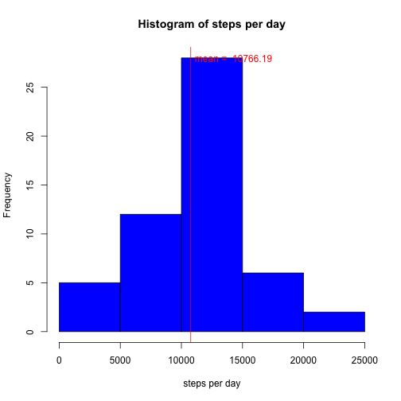
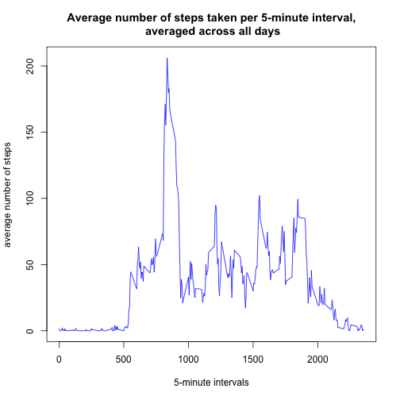
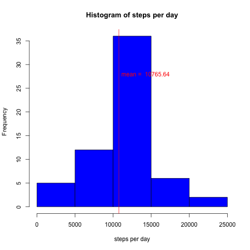
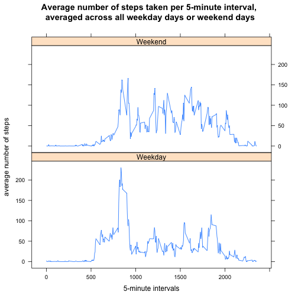

## Loading and preprocessing the data

```r
# load the data
data <- read.csv("../activity.csv")
# transform the date data to be of type Date
data$date <- as.Date(data$date, format = "%Y-%m-%d")
```


## What is mean total number of steps taken per day?

```r
# Calculate the total number of steps taken per day, can ignore the missing values in the dataset.
stepsPerDay <- tapply(data$steps, data$date, sum)

# Calculate and report the mean and median total number of steps taken per day
mean <- round(mean(stepsPerDay, na.rm = TRUE),2)
median <- median(stepsPerDay, na.rm = TRUE)

# Make a histogram of the total number of steps taken each day
hist(stepsPerDay, xlab = "steps per day", main = "Histogram of steps per day", col = "blue")
abline(v = mean, col = "red")
text(mean + 3500, 28, labels=paste("mean = ", mean), col = "red")
```

 

The **mean** steps taken per day is **10766.19** and the **median** is **10765**. 

## What is the average daily activity pattern?

```r
# Make a time series plot  of the 5-minute interval (x-axis) and the average number of steps taken, averaged across all days (y-axis)
meanStepsPerInterval <- tapply(data$steps, data$interval, mean, na.rm = TRUE)
uniqueInterval <- unique(data$interval)
plot(uniqueInterval, meanStepsPerInterval, type = "l", col = "blue", xlab = "5-minute intervals", ylab = "average number of steps", main = "Average number of steps taken per 5-minute interval,\n averaged across all days")
```

 

```r
#Which 5-minute interval, on average across all the days in the dataset, contains the maximum number of steps
maxSteps <- max(meanStepsPerInterval)
maxInterval <- uniqueInterval[match(maxSteps,meanStepsPerInterval)]
```
The **maximum number of steps** (averaged accross al days in the dataset) is **206.17**, which occurs during **interval 835**

## Imputing missing values

```r
# Calculate and report the total number of missing values in the dataset 
nas <- is.na(data$steps)
countNAs <- sum(nas)


# Create a new dataset that is equal to the original dataset but with the missing data filled in
# by using the mean for that 5-minute interval. The mean was rounded since steps are integers
newData <- data
for (i in 1:length(nas)){
    if(nas[i]){
        newData$steps[i] <- round(meanStepsPerInterval[match(data$interval[i],uniqueInterval)],0)
    }
}

# the mean and median total number of steps taken per day.
newStepsPerDay <- tapply(newData$steps, newData$date, sum)
newMean <- round(mean(newStepsPerDay),2)
newMedian <- round(median(newStepsPerDay),2)

# Make a histogram of the total number of steps taken each day
hist(newStepsPerDay, xlab = "steps per day", main = "Histogram of steps per day", col = "blue")
abline(v = newMean, col = "red")
text(newMean + 3500, 28, labels=paste("mean = ",round(newMean,2)), col = "red")
```

 

There were **2304 missing values** in the dataset. To fill in the missing values, I replaced it with the rounded mean for that 5-minute interval. Above we can see an updated histogram with the total numer of steps taken each day, using the new dataset. The **mean** and **median** were **10765.64** and **10762**, respectively. We can see that although the values do differ from the first part of the report, it was minimal. The **difference in mean is 0.55**, or 0.01%. The **difference in median is 3**, or 0.03 %. Although the overall shape of the histogram didn't change much, we see higher frequencies since now we have more data.

## Are there differences in activity patterns between weekdays and weekends?

```r
#Create a new factor variable in the dataset with two levels – “weekday” and “weekend” indicating whether a given date is a weekday or weekend day.
newData$weekday <- weekdays(newData$date, abbreviate = TRUE)
for(i in 1:length(newData$weekday)){
    if((newData$weekday[i]=="Sat")|(newData$weekday[i]=="Sun")){
        newData$weekday[i] <- "Weekend"
    }else{
        newData$weekday[i] <- "Weekday"
    }
}
newData$weekday <- factor(newData$weekday)

# Make a panel plot containing a time series plot of the 5-minute interval (x-axis) and the average number of steps taken, averaged across all weekday days or weekend days (y-axis).
library(tidyr)
library(lattice)
newMeanStepPerInterval <- as.data.frame(tapply(newData$steps,list(newData$interval,newData$weekday),mean))
newMeanStepPerInterval$interval <- uniqueInterval
newMeanStepPerInterval <- gather(newMeanStepPerInterval, weekday, mean, Weekday:Weekend)
xyplot(mean ~ interval | weekday, data=newMeanStepPerInterval, layout = c(1,2), type = "l", xlab = "5-minute intervals", ylab = "average number of steps", main = "Average number of steps taken per 5-minute interval,\n averaged across all weekday days or weekend days")
```

 
